### Primera Parte: Estudiando el planificador del sistema operativo xv6-riscv

1. ¿Qué política de planificación utiliza `xv6-riscv` para elegir el próximo proceso a ejecutarse?

`xv6-riscv` utiliza la política **Round-Robin**(RR). 
El scheduler recorre la tabla de procesos buscando un proceso que se pueda ejecutar (p->state == RUNNABLE). Cuando lo encuentra le asigna al CPU el proceso encontrado c->proc = p, y el estado del proceso a ejecutándose p->state = RUNNING, y luego llama a swtch para empezar a ejecutarlo.

Se provee el código de `xv6-riscv` donde se define este comportamiento.

```c
    for(p = proc; p < &proc[NPROC]; p++) {
      acquire(&p->lock);
      if(p->state == RUNNABLE) {
        // Switch to the chosen process.  It is the process's job
        // to release its lock and then reacquire it
        // before jumping back to us.
        p->state = RUNNING;
        c->proc = p;
        swtch(&c->context, &p->context);

        // Process is done running for now.
        // It should have changed its p->state before coming back.
        c->proc = 0;
      }
      release(&p->lock);
    }
```

2. ¿Cuáles son los estados en los que un proceso puede permanecer en `xv6-riscv` y qué los hace cambiar de estado?

Un proceso puede estar en uno y solo uno de los estados siguientes:

```c
enum procstate { UNUSED, USED, SLEEPING, RUNNABLE, RUNNING, ZOMBIE };
```
Además varias situaciones que hacen cambiar de estado a los procesos, como:

- Inicialización de un proceso, con fork() por ejemplo. (UNUSED -> RUNNABLE).
- El scheduler selecciona un proceso para ejecutar. (RUNNABLE -> RUNNING).
- Una interrupción del timer. (RUNNING -> RUNNABLE).
- Una llamada a sistema, como sleep() (RUNNING -> SLEEPING), exit() (RUNNING -> ZOMBIE) y sched() (RUNNING -> RUNNABLE).
- Una operación de I/O, pipes, usando wait(). (RUNNING -> SLEEPING).
- Termina un evento de los anteriores, wakeup(). (SLEEPING -> RUNNABLE).
- Un proceso intenta adquirir un lock en uso. (RUNNING -> SLEEPING).
- Se llama a freeproc() para liberar la memoria del proceso (USED -> UNUSED).

3. ¿Qué es un *quantum*? ¿Dónde se define en el código? ¿Cuánto dura un *quantum* en `xv6-riscv`?
Pista: Se puede empezar a buscar desde la system call `uptime` o leyendo la documentación de `xv6-riscv` en la sección de interrupciones.

La política Round Robin ejecuta un proceso por un periodo de tiempo llamado a veces scheduling quantum. Y un quantum debe ser múltiplo del periodo del timer-interrupt.

En `xv6-riscv`, se implementa a través del mecanismo de interrupciones y el valor exacto puede variar, pero es generalmente 1000000 ciclos de clock (1 ms en algunos sistemas). 

Se define en:

```c
 int interval = 1000000; // cycles; about 1/10th second in qemu.
```
**kernel/start.c, línea 69.**

4. ¿En qué parte del código ocurre el cambio de contexto en `xv6-riscv`? ¿En qué funciones un proceso deja de ser ejecutado? ¿En qué funciones se elige el nuevo proceso a ejecutar?

El cambio de contexto se origina en las funciones scheduler y sched. En el archivo kernel/proc.c en la línea 463,

```c
    swtch(&c->context, &p->context);
```
y en la línea 497,

```c
    swtch(&p->context, &mycpu()->context);
```

la llamada a swtch ejecuta el código en swtch.S

```c
    void swtch(struct context *old, struct context *new);
```

Luego un proceso deja de ser ejecutado cuando:
- El proceso voluntariamente entrega el CPU llamando a sleep() o yield(). Luego de una señal de exit/kill de un proceso (llama a yield) o una llamada a wait (llama a sleep) de un proceso esperando algún dispositivo. 
- Ocurre un interrupt, donde usertrap() y kerneltrap() llaman a yield().

Y un nuevo proceso a ejecutar se elige en la función scheduler.
			
5. ¿El cambio de contexto consume tiempo de un *quantum*?

El cambio de contexto en la política Round Robin si consume tiempo de un quantum, de hecho se consume del quantum del siguiente proceso.
Como ejemplo el planteado en el libro de la cátedra en la parte de amortización.

> For example, if the time slice is set to 10 ms, and the context-switch cost
> is 1 ms, roughly 10% of time is spent context switching and is thus wasted.
> 
> capítulo Scheduling, página 8, TIP: AMORTIZATION CAN REDUCE COSTS.

### Segunda Parte: Medir operaciones de cómputo y de entrada/salida

#### Experimento 1: ¿Cómo son planificados los programas iobound y cpubound?

Responder las siguientes preguntas utilizando gráficos y/o tablas para justificar sus respuestas:

1. Describa los parámetros de los programas cpubench e iobench para este experimento (o sea, los define al principio y el valor de N. Tener en cuenta que podrían cambiar en experimentos futuros, pero que si lo hacen los resultados ya no serán comparables).

**Parámetros Globales**

**N**: Cantidad de veces que se va a ejecutar el bench.

**Quantum**: Se describió en el punto anterior.

**Parámetros iobench**

**IO_EXPERIMENT_LENGTH**: Cantidad de escrituras/lecturas que se va a hacer por cada bench.

**IO_OPSIZE**: Cantidad de bytes que se van a escribir/leer respectivamente por cada experimento.

**Parámetros cpubench**

**CPU_MATRIX_SIZE**: Tamaño de la matriz a usar para cada bench.

**CPU_EXPERIMENT_LENGTH**: Cantidad de veces que se va a operar la matriz por cada experimento.

2. ¿Los procesos se ejecutan en paralelo? ¿En promedio, qué proceso o procesos se ejecutan primero? Hacer una observación cualitativa.

Los procesos no se ejecutan en paralelo porque estamos ejecutando los experimentos en un único CPU (CPUS=1).

El scheduler usa el mecanismo de time-sharing. Este crea la ilusión de que los procesos se ejecutan en paralelo intercambiando rápidamente entre procesos el uso del CPU.

Podemos ejecutar los benchs para ver como se ejecutan los procesos, usando la métrica del **start_tick** además de los **elapsed_ticks**.

Estos benchs se van a ejecutar con los parámetros:

 - MATRIX_SIZE = 128
 - CPU_EXPERIMENT_LEN = 256
 - OP_SIZE = 64
 - IO_EXPERIMENT_LEN = 512
 - N = 4
 - QUANTUM = 1000000/10

Primero si ejecutamos el comando: ```cpubench 4 &```

Obtenemos el **output**:

| PID | IO/CPU     | start-tick | elapsed-tick |
|-----|------------|------------|--------------|
|   4 | [cpubench] |        961 |         3395 |
|   4 | [cpubench] |       4357 |         2818 |
|   4 | [cpubench] |       7176 |         3029 |
|   4 | [cpubench] |      10206 |         2823 |

El cual podemos representar en un gráfico como el siguiente;

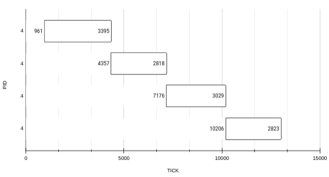

Del gráfico, cada rectángulo representa el **elapsed-ticks** del bench **N** del proceso **PID** con su valor dentro, y a la izquierda del rectángulo el **start-tick** del bench.

Podemos ver como se ejecutan de forma secuencial los cuatro benchs del proceso (**PID: 4**).

Luego para comparar, ¿qué pasa cuando ejecutamos más de un proceso en paralelo?

Ejecutamos el comando: ```cpubench 4 &; cpubench 4 &; cpubench 4 &```

Del cual obetenemos el **output**:

| PID | IO/CPU     | start-tick | elapsed-ticks |
|-----|------------|------------|---------------|
|  11 | [cpubench] |      98225 |          8448 |
|  13 | [cpubench] |      98226 |          8451 |
|  14 | [cpubench] |      98227 |          8526 |
|  11 | [cpubench] |     106676 |          9156 |
|  13 | [cpubench] |     106680 |          9156 |
|  14 | [cpubench] |     106756 |          9186 |
|  11 | [cpubench] |     115835 |          8022 |
|  13 | [cpubench] |     115839 |          8022 |
|  14 | [cpubench] |     115945 |          8148 |
|  11 | [cpubench] |     123860 |          8838 |
|  13 | [cpubench] |     123864 |          8841 |
|  14 | [cpubench] |     124096 |          8714 |

Del cual obtenemos el gráfico;

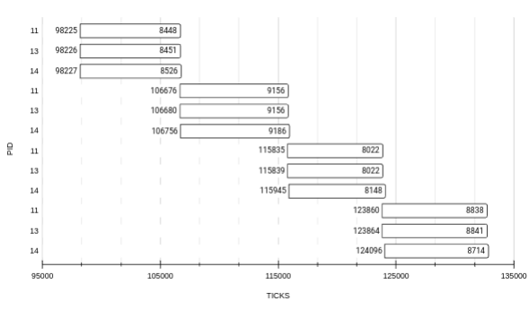

En este podemos ver como **elapsed-ticks** de cada uno de los procesos se triplicó, lo cual nos dice que el scheduler estuvo intercambiando entre los procesos en quantums iguales la planificación de los tres procesos (**PIDs: 11, 13, 14**) por más que se solapen en el orden cronológico del **wall-time** que contiene la cantidad de ticks que el proceso estuvo RUNNING o RUNNABLE.

De esta manera comprobamos nuestra afirmación de que los procesos no se ejecutan en paralelo, sino que es una ilusión obtenida a partir del **time-sharing**.

Luego cuando ejecutamos en paralelo procesos de distinto tipo (cpubound/iobound).

Podemos ver que la politíca RR planifica primero los procesos cpubound.

Para verificar esto vamos a analizar los siguientes benchs.

Ejecutamos: ```cpubench 4 &; iobench 4 &; iobench 4 &```

Obtenemos de **output**:

| PID | IO/CPU     | start-tick | elapsed-ticks |
|-----|------------|------------|---------------|
|  45 | [cpubench] |      31920 |           261 |
|  45 | [cpubench] |      32182 |           256 |
|  45 | [cpubench] |      32440 |           246 |
|  45 | [cpubench] |      32687 |           249 |
|  48 | [iobench]  |      31922 |          1161 |
|  47 | [iobench]  |      31921 |          1199 |
|  48 | [iobench]  |      33084 |           270 |
|  47 | [iobench]  |      33121 |           271 |
|  48 | [iobench]  |      33355 |           261 |
|  47 | [iobench]  |      33393 |           260 |
|  48 | [iobench]  |      33617 |           266 |
|  47 | [iobench]  |      33653 |           283 |

Luego lo representamos en un gráfico:

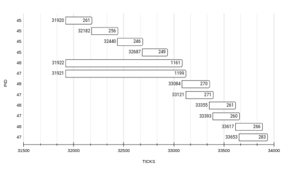

Podemos ver que si bien los tres procesos (**PIDs: 45, 47, 48**) llegan al planificador al mismo tiempo (diferencia de un tick) el proceso CPU-bound (**PID: 45**) se planifica primero mientras los otros dos IO-bound casi no obtienen ticks en estado RUNNING hasta que se completan las cuatro instancias cpubenchs.

Luego si ejecutamos: ```iobench 4 &; cpubench 4 &; cpubench 4 &```

Obtenemos el **output**:

| PID | IO/CPU     | start-tick | elapsed-ticks |
|-----|------------|------------|---------------|
|  41 | [cpubench] |      25944 |           395 |
|  40 | [cpubench] |      25945 |           423 |
|  41 | [cpubench] |      26341 |           292 |
|  40 | [cpubench] |      26368 |           314 |
|  41 | [cpubench] |      26635 |           406 |
|  40 | [cpubench] |      26682 |           476 |
|  41 | [cpubench] |      27043 |           434 |
|  40 | [cpubench] |      27160 |           401 |
|  38 | [iobench]  |      25955 |          1932 |
|  38 | [iobench]  |      27888 |           418 |
|  38 | [iobench]  |      28307 |           417 |
|  38 | [iobench]  |      28725 |           418 |

Representado en un grafico como el anterior:

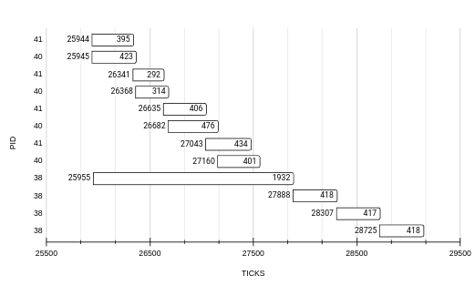

Otra vez podemos ver como la politica de planificacion RR prioriza la planificacion de los procesos CPU-bound por sobre los procesos IO-bound.

Esto nos indica que RR es una politica de buena performance pero de baja interactividad.

3. ¿Cambia el rendimiento de los procesos iobound con respecto a la cantidad y tipo de procesos que se estén ejecutando en paralelo? ¿Por qué?

Para medir el rendimiento vamos a utilizar la metrica de operaciones por tick (OPs/Tick).

Ahora lo primero es tener una referencia de la ejecucion de un proceso IO-bound para poder comparar el rendimiento con los escenarios en que se ejecutan mas procesos.

Entonces si ejecutamos: ```iobench 4 &``` 

Luego tomamos el promedio de OPs/Tick entre los 4 benchs, para cada medicion mientras variamos los parametros OP_SIZE y EXP_LEN.

Ordenamos los resultados en un grafico;

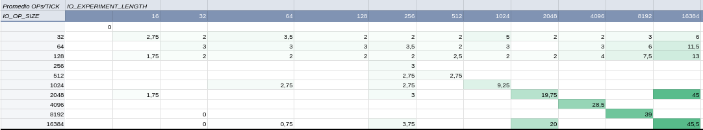

Podemos ver en el grafico el valor de OPs/Ticks aumenta mientras aumentas los valores de los dos parametros.
Ademas si aumentamos los valores de EXP_LEN con OP_SIZE bajos tambien tiende a aumentar.
Esto no pasa en el escenario contrario donde las OPs/Tick tienden a acercarse a 0 (cero).

Ahora si ejecutamos: ```iobench 4 &; iobench 4 &; iobench 4 &```

Promediando ahora entre los 12 benchs, para cada medicion mientras variamos los parametros OP_SIZE y EXP_LEN.

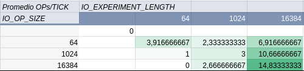

El comportamiento es similar aunque los valores tienden a bajar porque se reparte el CPU entre los tres procesos.

Luego para ver como se comporta el rendimiento de IO-bound con otros CPU-bound, ejecutamos:

```iobench 4 &; cpubench 4 &; coubench 4 &```

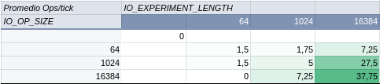

Otra vez baja el rendimiento del proceso IO-bound. Aunque menos que en el caso de tres procesos IO-bound.
Porque...

4. ¿Cambia el rendimiento de los procesos cpubound con respecto a la cantidad y tipo de procesos que se estén ejecutando en paralelo? ¿Por qué?

Luego para ver como se comporta el rendimiento de CPU-bound comenzamos a analizar el comando:

```cpubench 4 &```

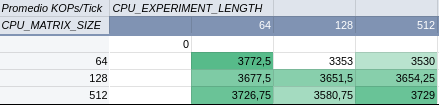

Y comparamos con el escenario en que se ejecuta junto a mas procesos CPU-bound.

```cpubench 4 &; cpubench 4 &; cpubench 4 &```

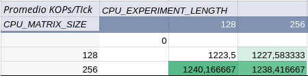

Ademas comparamos el rendimiento con otros procesos IO-bound.

```cpubench 4 &; iobench 4 &; iobench 4 &```

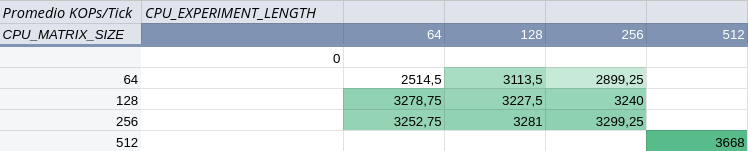

y podemos ver como en el caso del proceso CPU-bound junto a otros del mismo tipo el rendimiento se reduce a un tercio, a diferencia del caso que se ejecuta junto a otros procesos de tipo IO-bound el rendimiento es aproximadamente el mismo. 
Otra razon por la que se concluye en decir que la politica RR prioriza la ejecucion de los procesos CPU-bound.

Ademas podemos ver como al ejecutar 

```cpubench 4 &; cpubench 4 &; cpubench 4 &```

con parametros: 

- MATRIX_SIZE = 512
 - CPU_EXPERIMENT_LEN = 512
 - OP_SIZE = 64
 - IO_EXPERIMENT_LEN = 512
 - N = 4

| PID | IO/CPU     | start-tick | elapsed-tick |
|-----|------------|------------|--------------|
|   7 | [iobench]  |       1158 |          659 |
|   7 | [iobench]  |       1817 |          900 |
|   7 | [iobench]  |       2717 |          951 |
|   8 | [iobench]  |       1159 |         2607 |
|   7 | [iobench]  |       3668 |          993 |
|   8 | [iobench]  |       3766 |         3070 |
|   8 | [iobench]  |       6838 |         3160 |
|   8 | [iobench]  |      10000 |         3157 |
|   5 | [cpubench] |       1154 |        19559 |
|   5 | [cpubench] |      20714 |        18456 |
|   5 | [cpubench] |      39171 |        18447 |
|   5 | [cpubench] |      57619 |        18513 |

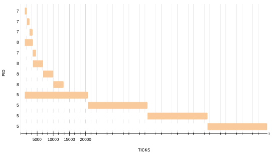

se excluyen las etiquetas con los valores, a diferencia de los graficos anteriores.

Asi podemos ver como aunque sean planificados los procesos CPU-bound por sobre los IO-bound los segundos terminan antes su ejecucion.

5. ¿Es adecuado comparar la cantidad de operaciones de cpu con la cantidad de operaciones iobound?

No es adecuado comparar  la cantidad de operaciones de procesos CPU-bound con IO-bound por:

La Diferencia de Operaciones:
Las operaciones de CPU y de IO son intrínsecamente diferentes en cuanto a tiempo de ejecución y requerimientos de recursos. 
El rendimiento de CPU se mide por la cantidad de operaciones realizadas en el menor tiempo posible, para IO-bound es más importante el tiempo de respuesta.

Bloqueo en Operaciones IO: 
Los procesos IO-bound dependen de recursos externos (por ejemplo, disco), lo cual puede afectar su tiempo en espera y distorsionar las métricas si se comparan con CPU-bound.

En conclusión, el análisis muestra que la política RR de `xv6-riscv` favorece los procesos IO-bound debido a la alta utilización de sus quantums y la menor frecuencia de bloqueos. Las métricas y gráficos respaldan esta observación.

Luego para expandir este analisis medimos la cantidad de context switchs por proceso en los diferentes escenarios con los parámetros:

 - MATRIX_SIZE = 128
 - CPU_EXPERIMENT_LEN = 256
 - OP_SIZE = 64
 - IO_EXPERIMENT_LEN = 512
 - N = 4
 - QUANTUM = 1000000/10

Se aclara que se cuentan los context_switch(cpu, p) de scheduler() y context_switch(p, cpu) de sched().

Y de los resulatdos obetenidos representados en este gráfico:

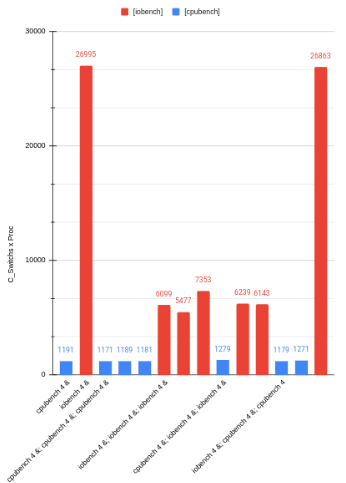

De este obeservamos que:

Los procesos IO-bound consistentemente tienen mayor context switchs por proceso que los CPU-bound, sin importar el escenario (solos o combinados).

El numero de context switchs es similar para los procesos CPU-bound.

Ejecutando de los dos tipos combinados los procesos IO-bound experimentan un mayor numero de context switchs.

La consistencia de la cantidad de CS(Context Switch) para los procesos CPU-bound indica que la politica RR los trata de manera justa.
Pero el gran contraste con los de IO-bound sugiere que el scheduler no sea optimo.

Esta informacion refuerza la conclusion anterior:
RR prioriza CPU-bound por sobre IO-bound.
Esto podria potencialmente impactar en la eficiencia de los procesos IO-bound.

#### Experimento 2: ¿Qué sucede cuando cambiamos el largo del quantum?

Analizaremos que sucede cuando cambiamos el largo del quantum.

Hasta ahora estubimos trabajando con un QUANTUM=100000000/10.

Para el Caso QUANTUM = 1000000/10000 no se emula `xv6-riscv`;

Caso QUANTUM = 1000000/1000 lo mismo;

Caso QUANTUM = 1000000/10;
Es el caso con el que veniamos trabajando.

Caso QUANTUM = 1000000/100;

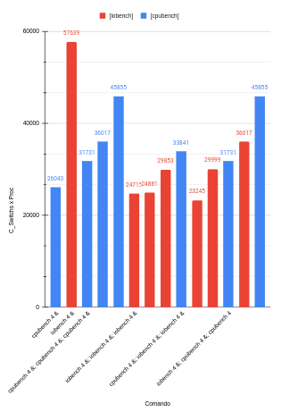 

```iobench 4 &; cpubench 4 &; cpubench 4 &```

| PID | IO/CPU     | start-tick | elapsed-tick |
|-----|------------|------------|--------------|
|  15 | [cpubench] |      83850 |         8847 |
|  12 | [iobench]  |      83827 |        10213 |
|  15 | [cpubench] |      92737 |         8981 |
|  12 | [iobench]  |      94079 |         9162 |
|  14 | [cpubench] |      83837 |        19469 |
|  15 | [cpubench] |     101761 |         8855 |
|  12 | [iobench]  |     103286 |         9239 |
|  15 | [cpubench] |     110649 |         8973 |
|  14 | [cpubench] |     103378 |        17713 |
|  12 | [iobench]  |     112555 |         9865 |
|  14 | [cpubench] |     121124 |         3875 |
|  14 | [cpubench] |     125016 |         3204 |

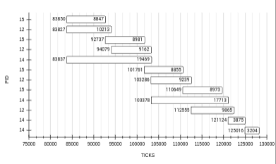

```cpubench 4 &; iobench 4 &; iobench 4 &```

| PID | IO/CPU     | start-tick | elapsed-tick |
|-----|------------|------------|--------------|
|   7 | [iobench]  |      24662 |         5276 |
|   8 | [iobench]  |      24675 |         7858 |
|   5 | [cpubench] |      24649 |         8182 |
|   7 | [iobench]  |      29968 |         7803 |
|   5 | [cpubench] |      32871 |         8096 |
|   8 | [iobench]  |      32585 |         8729 |
|   7 | [iobench]  |      37796 |         7856 |
|   5 | [cpubench] |      40999 |         8296 |
|   8 | [iobench]  |      41357 |         8475 |
|   7 | [iobench]  |      45680 |         8012 |
|   5 | [cpubench] |      49325 |         7256 |
|   8 | [iobench]  |      49877 |         8478 |

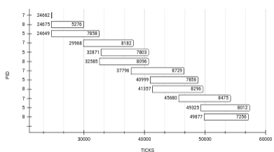

Caso QUANTUM = 1000000/1;

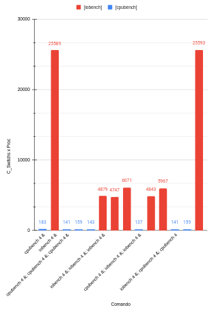

```iobench 4 &; cpubench 4 &; cpubench 4 &```

| PID | IO/CPU     | start-tick | elapsed-tick |
|-----|------------|------------|--------------|
|  28 | [cpubench] |       1614 |           28 |
|  27 | [cpubench] |       1613 |           30 |
|  28 | [cpubench] |       1642 |           28 |
|  27 | [cpubench] |       1643 |           28 |
|  28 | [cpubench] |       1670 |           30 |
|  27 | [cpubench] |       1671 |           30 |
|  28 | [cpubench] |       1700 |           28 |
|  27 | [cpubench] |       1701 |           28 |
|  25 | [iobench]  |       1625 |          139 |
|  25 | [iobench]  |       1764 |           41 |
|  25 | [iobench]  |       1805 |           41 |
|  25 | [iobench]  |       1846 |           39 |

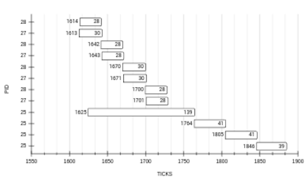

```cpubench 4 &; iobench 4 &; iobench 4 &```

| PID | IO/CPU     | start-tick | elapsed-tick |
|-----|------------|------------|--------------|
|  33 | [cpubench] |       2050 |           23 |
|  33 | [cpubench] |       2073 |           21 |
|  33 | [cpubench] |       2094 |           21 |
|  33 | [cpubench] |       2115 |           21 |
|  36 | [iobench]  |       2051 |           99 |
|  35 | [iobench]  |       2051 |          102 |
|  35 | [iobench]  |       2153 |           14 |
|  36 | [iobench]  |       2150 |           20 |
|  35 | [iobench]  |       2167 |           19 |
|  36 | [iobench]  |       2170 |           19 |
|  36 | [iobench]  |       2190 |           20 |
|  35 | [iobench]  |       2187 |           27 |

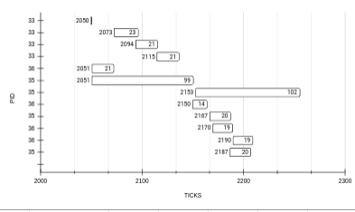

Luego responder:

1. ¿Fue necesario modificar las métricas para que los resultados fueran comparables? ¿Por qué?

No se modificaron las métricas, pero sí interpretar los resultados en función del cambio en el quantum. Al reducir el quantum, las métricas como la cantidad de CS, start-tick y elapsed-ticks pueden variar significativamente.

2. ¿Qué cambios se observan con respecto al experimento anterior? ¿Qué comportamientos se mantienen iguales?

Cambiando el largo del Quantum, si lo reducimos, los CS de los CPU-bound crecen acercandose a los de IO-bound, ademas que los procesos IO-bound son planificados mas veces que en los casos de Quantum mas grande.

3. ¿Con un quatum más pequeño, se ven beneficiados los procesos iobound o los procesos cpubound?

Con un quantum mas pequeño tiende a volverse mas equitativa la planificacion entre IO-bound y CPU-bound.

### Tercera Parte: Asignar prioridad a los procesos

2. Para comprobar que estos cambios se hicieron correctamente, modifique la función `procdump` (que se invoca con `CTRL-P`) para que imprima la prioridad de los procesos. Así, al correr nuevamente `iobench` y `cpubench`, debería darse que luego de un tiempo que los procesos `cpubench` tengan baja prioridad mientras que los `iobench` tengan alta prioridad.

```bash

$ iobench 4 &; cpubench 4 &; cpubench 4 &
$ 8	[cpubench]	KOPs/Ticks	1720	1222	312

[1]	 sleep  	 init 	 High 
[2]	 sleep  	 sh 	 High 
[8]	 running 	 cpubench 	 Low 
[5]	 runble 	 iobench 	 High 
[7]	 runble 	 cpubench 	 Low 

7	[cpubench]	KOPs/Ticks	1626	1221	33

[1]	 sleep  	 init 	 High 
[2]	 sleep  	 sh 	 High 
[8]	 running 	 cpubench 	 Low 
[5]	 runble 	 iobench 	 High 
[7]	 runble 	 cpubench 	 Low 

7	[cpubench]	KOPs/Ticks	1667	1551	322
...

```

### Cuarta Parte: Implementar MLFQ


1. Modifique el planificador de manera que seleccione el próximo proceso a planificar siguiendo las siguientes reglas:
    - MLFQ regla 1: Si el proceso A tiene mayor prioridad que el proceso B, corre A. (y no B)
    - MLFQ regla 2: Si dos procesos A y B tienen la misma prioridad, corre el que menos veces fue elegido por el  planificador.

2. Repita las mediciones de la segunda parte para ver las propiedades del nuevo planificador.

Repitiendo las mediciones obtenemos resultados similares, aunque los procesos IO-bound se mantienen en las colas de mayor prioridad por la mayor cantidad de veces que llaman a sleep() esto permite mantener un buen rendimiento con los procesos CPU-bound mientras se aumenta el tiempo de respuesta de los procesos IO-bound.

3. Para análisis responda: ¿Se puede producir starvation en el nuevo planificador? Justifique su respuesta.

Sí, es posible que se produzca starvation en este planificador. 
La regla 1: Los procesos en niveles de baja prioridad pueden quedar en sus colas si los procesos de mayor prioridad generan una carga constante.
Como resultado, los procesos de menor prioridad podrían no ejecutarse nunca, o únicamente cuando las colas de mayor prioridad están vacías.


Se modifico en el codigo de `xv6-riscv` para implementar **MLFQ** los siguientes archivos.

**proc.h**
```c
// Being 0 the minimum priority and 3 the maximum priority by Lab 3 req.
#define NPRIO 3 
...
// Multi-Level-Feedback-Queue 
uint entry_time;             // Entry time in the current queue.
uint queue_ticks[NPRIO];     // Number of ticks done in each queue.
uint current_queue;          // Current queue number of the process.
uint no_of_times_scheduled;  // Number of times the process been scheduled.
```

**proc.c**
```c
p->current_queue = NPRIO - 1; // MLFQ regla 3
  p->entry_time = ticks;
  for(int i = 0; i < NPRIO; i++) {
    p->queue_ticks[i] = 0;
  }
  p->no_of_times_scheduled = 0;
    ...
p->current_queue = NPRIO - 1; // MLFQ regla 3
  p->entry_time = ticks;
  for(int i = 0; i < NPRIO; i++) {
    p->queue_ticks[i] = 0;
  }
  p->no_of_times_scheduled = 0;
    ...
// `NPRIO-1` maximum priority by lab 3 requirements.
int highest_queue = NPRIO - 1; 

// No priority boost.

    // Iterate process table to find the RUNNABLE process. 
    // with the highest priority and lowest number of times scheduled.
    for (p = proc; p < &proc[NPROC]; p++) {
      acquire(&p->lock);

      if (p->state == RUNNABLE) {

        // Case 1: First RUNNABLE process founded.
        if (chosenProc == 0) { 
          chosenProc = p;
          highest_queue = chosenProc->current_queue;
        }

        // Case 2: MLFQ Regla 1.
        // Current process has higher priority than the chosen process.
        else if (p->current_queue > highest_queue) {
          chosenProc = p;
          highest_queue = chosenProc->current_queue;
        }

        // Case 3: MLFQ Regla 2.
        // Current process has the same priority as the chosen process.
        // Chose by the number of times scheduled.
        else if (p->current_queue == highest_queue && 
          p->no_of_times_scheduled < chosenProc->no_of_times_scheduled) {
          chosenProc = p; 
        }

      }
      release(&p->lock);
    }

    // Schedule the process.
    if (chosenProc != 0) {
      acquire(&chosenProc->lock);
      if (chosenProc->state == RUNNABLE) {
        // Increment the number of times the process has been scheduled.
        chosenProc->no_of_times_scheduled++; 
        // Update the entry time of the process.
        chosenProc->entry_time = ticks;      

        // Switch state and execute the process.
        chosenProc->state = RUNNING;
        c->proc = chosenProc;
        swtch(&c->context, &chosenProc->context);

        // Process is done running (either by quantum, sleep or exit).
        c->proc = 0;
        // Update the number of ticks done in the current queue.
        int elapsed_ticks = ticks - chosenProc->entry_time;
        chosenProc->queue_ticks[chosenProc->current_queue] += elapsed_ticks; 
      }
      release(&chosenProc->lock);
    }
    ...
  // MLFQ regla 4.
  // Decrease priority if process has spent whole quantum.
  // Timer interrupt calls yield from user/kernel trap.
  if (p->current_queue > 0) {
    p->current_queue--; 
  };
  // Add time spent on this current_queue
  p->queue_ticks[p->current_queue] += (ticks - p->entry_time); 
...
  // MLFQ regla 4.
  // Increase priority if process goes to sleep before consuming whole quantum.
  if (p->current_queue < NPRIO - 1) {
    p->current_queue++; 
  };
  // Add to time spent on current_queue.
  p->queue_ticks[p->current_queue] += (ticks - p->entry_time); 
```


[Spreadsheet con las mediciones](https://docs.google.com/spreadsheets/d/1jeh3NYkHs8Kld6pcmLMKca0xK9YH1Bg-Cc__qPwCJc0/edit?usp=sharing)